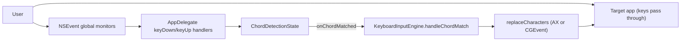
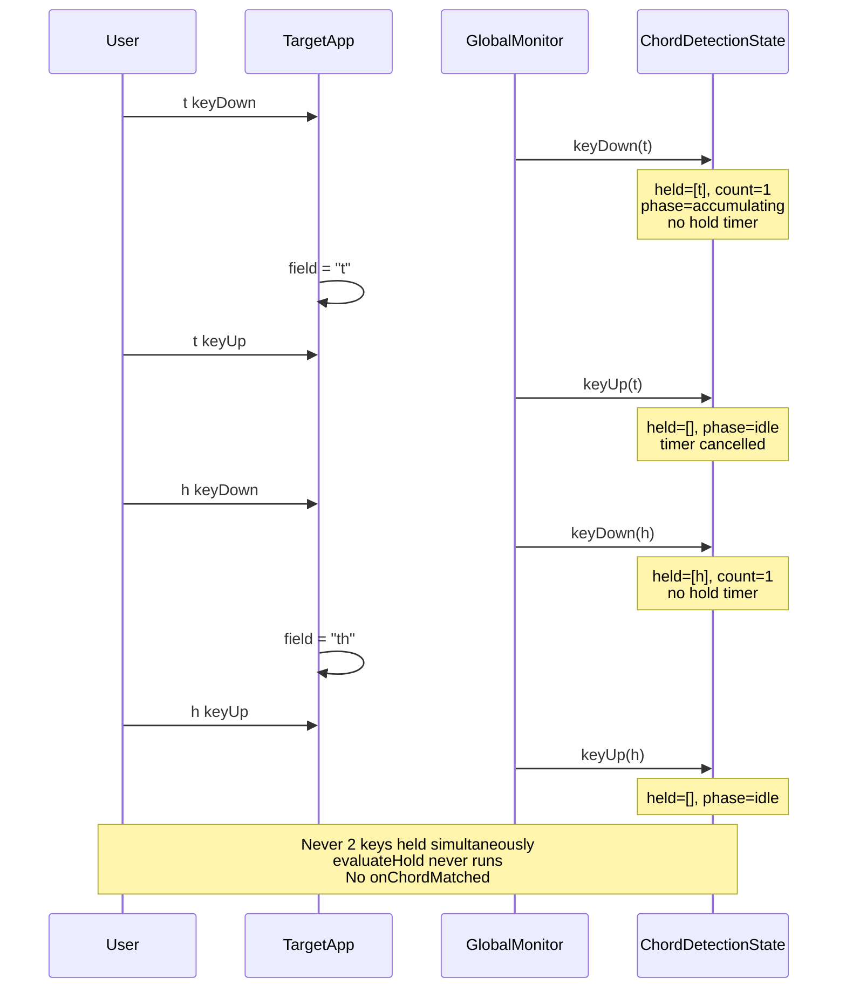
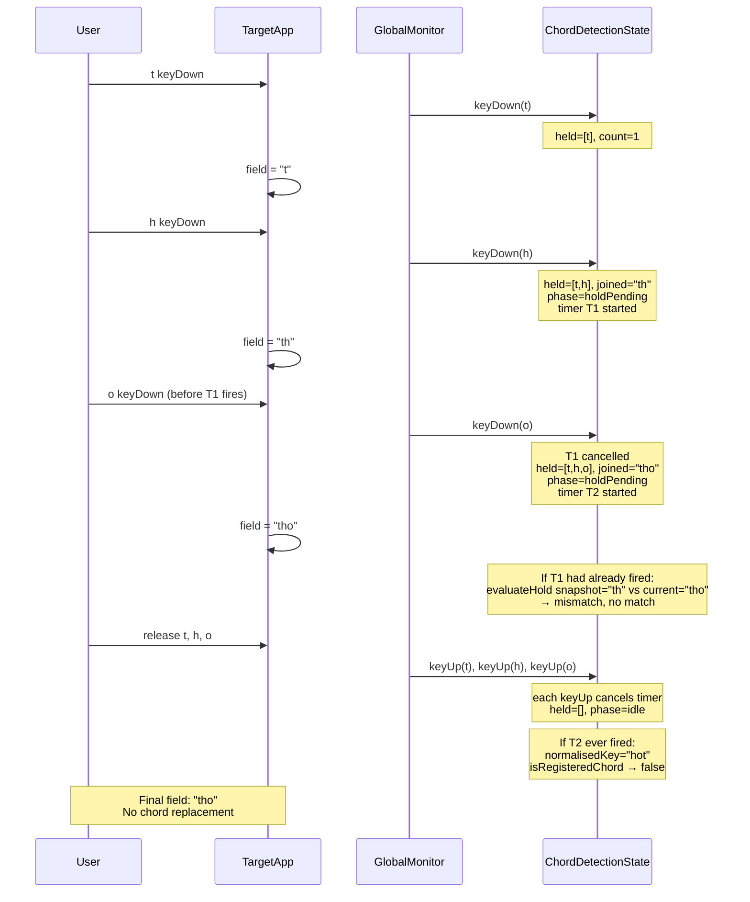
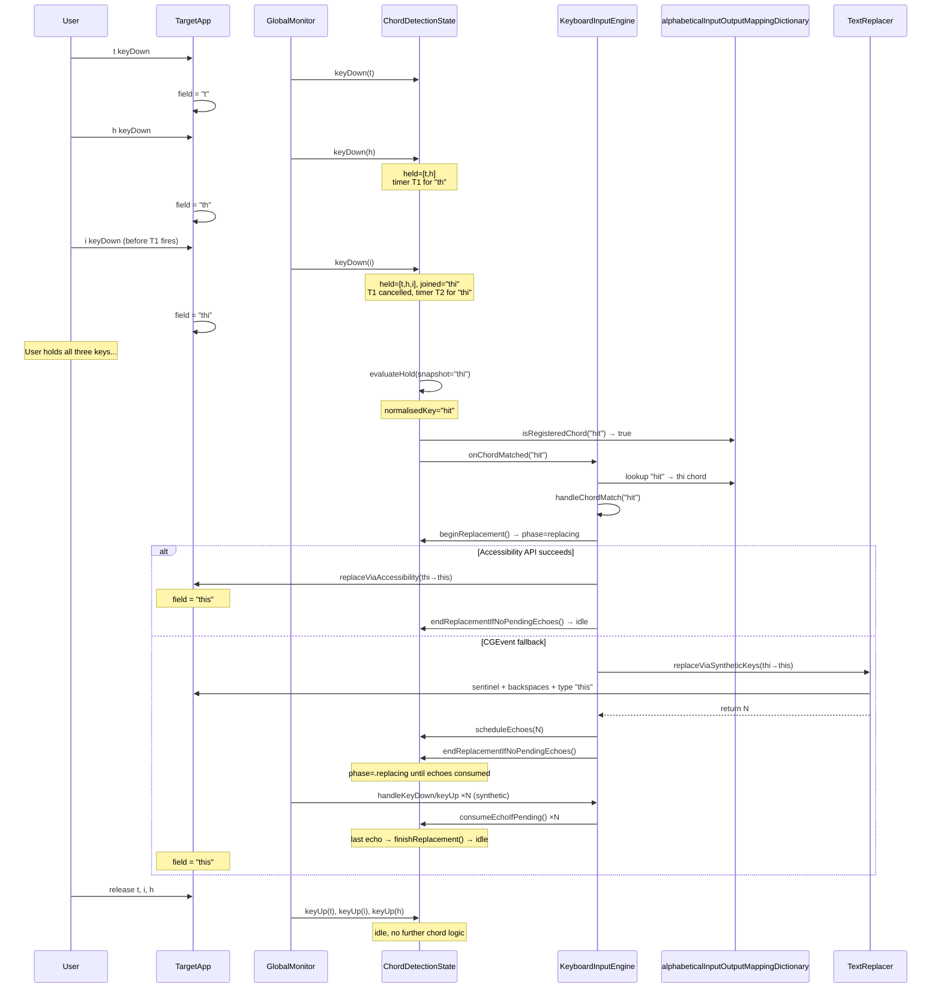
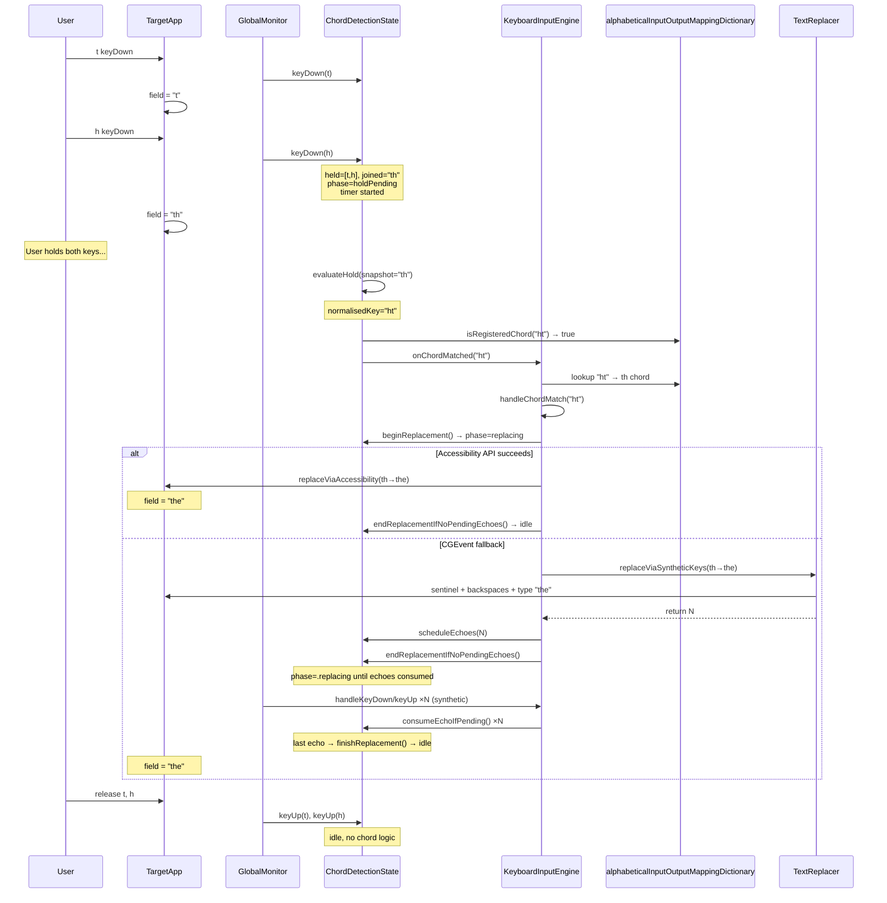

# Chord typing sequence diagrams

Sequence diagrams for four typing scenarios with chords `th→the` and `thi→this`, based on the current observe-only architecture in `AppDelegate` and `ChordDetectionState`.

## Configured chords

| User input | Normalised key (sorted) | Output |
| ---------- | ----------------------- | ------ |
| `th`       | `ht`                    | `the`  |
| `thi`      | `hit`                   | `this` |

Normalisation sorts the held characters alphabetically (`Chord.normalisedInputKey` / `chord.inputSorted`).

---

## Architecture (current code)

### Input path

- **Global keyboard monitors only** — every keyDown/keyUp reaches the target app immediately; handlers do not suppress input.
- Characters come from `NSEvent.characters` in `keyDownHandler`.
- Modifier keys (cmd/option/control/fn), backspace, space, tab, return, escape, and left/right arrow **reset** chord detection and clear held keys.
- During replacement, `ChordDetectionState` is in phase `.replacing` and ignores further keyDown/keyUp until replacement completes (immediately on AX success, or when the last synthetic echo is consumed on the CGEvent path).

### Chord registry (lookup dictionary)

`alphabeticalInputOutputMappingDictionary` maps normalised input key → `Chord`. It is rebuilt in `AppSettings.recalculateAlphabeticalMapping()` only when:

| Trigger | Where |
| ------- | ----- |
| App launch / settings file read | `readAppSettingsFromFile()` (called from `init`) |
| Chord added or removed | `chords` `didSet` |
| Chord edited in UI | `updateChord()` |
| Synced settings reload | `reloadFromSyncedStorage()` → `readAppSettingsFromFile()` |

The registry is **not** rebuilt on hold evaluation or on match. At launch, `AppDelegate` wires `isRegisteredChord` once to read the existing dictionary; `evaluateHold` calls that callback; `handleChordMatch` looks up the chord again by normalised key.

### Hold timer and match rule

1. `keyDown` appends to `heldKeys` (deduplicated by keyCode; repeats ignored).
2. When `heldKeys.count >= 2`, a debounced hold timer starts (`scheduleHoldTimer`).
3. Any further keyDown or keyUp **cancels** the timer; if still ≥2 keys held, a **new** timer starts with a fresh snapshot.
4. When the timer fires, `evaluateHold` checks:
   - phase is still `.holdPending`
   - current held characters equal the snapshot (set unchanged for full hold duration)
   - `isRegisteredChord(normalisedKey)` is true
5. On match → `onChordMatched` → `handleChordMatch` → `beginReplacement()` → `replaceCharacters` → `endReplacementIfNoPendingEchoes()` (CGEvent path finishes replacement when synthetic echoes are consumed).

**No prefix trie or deferral.** If the held set is registered when the timer fires, the chord commits **on the timer** while keys may still be held — even when a longer chord (e.g. `thi`) is also configured.

### Replacement

- **Primary:** Accessibility API (`replaceViaAccessibility`) when `useAccessibilityAPI` is enabled and the focused field supports text writes. No synthetic echoes; `endReplacementIfNoPendingEchoes()` completes replacement immediately.
- **Fallback:** CGEvent synthetic backspace + type (`replaceViaSyntheticKeys`). The replacer posts CGEvents synchronously and returns an echo count; `scheduleEchoes(count)` runs on return, before the run loop delivers those events to the monitor. Each synthetic callback is dropped via `consumeEchoIfPending()`; `finishReplacement()` runs when the last echo is consumed.
- After a successful match, capitalisation mode is turned off and usage stats are incremented.

### Implications for overlapping chords

Holding `t`+`h` long enough commits `the` even if you intended `thi`. To get `this`, roll `t`+`h`+`i` quickly without holding `t`+`h` for the full duration, or increase hold time.

Sequential `t` then `h` with no overlap **does not match** `th→the`: the field may show `th`, but two keys are never held at once so the hold timer never runs.

### Detection phases

| Phase | Meaning |
| ----- | ------- |
| `idle` | No keys held |
| `accumulating` | One or more keys held; timer not pending (or cancelled after key change) |
| `holdPending(snapshot)` | Timer running for stable held set |
| `replacing` | Match fired; replacement in progress |

---

## Case 1: `t` ↓ `t` ↑ `h` ↓ `h` ↑ — keys never held together

**Result:** Field shows `th`; **no chord fires**.

---

## Case 2: `t` ↓ `h` ↓ `o` ↓ … release all — `o` before hold completes

**Result:** Field shows `tho`; **no chord fires**. Hold window for `th` is cancelled/rescheduled when `o` arrives; `hot` is not registered.

---

## Case 3: `t` ↓ `h` ↓ `i` ↓ hold ↓ release `t`, `i`, `h` — matches `thi→this`

**Result:** Three keys held; after hold completes on stable `thi`, **`thi→this` fires on the timer**. If `t`+`h` were held long enough before `i` arrived, `the` would have committed first (see case 4).

---

## Case 4: `t` ↓ `h` ↓ hold — matches `th→the` (even with `thi` configured)

**Result:** After hold completes on stable `t`+`h`, **`the` commits on the timer** while keys may still be held. No deferral, no wait for keyUp.

---

## Quick reference

| Case                  | Keys ever held together? | Hold timer completes?   | Match trigger | Field result |
| --------------------- | ------------------------ | ----------------------- | ------------- | ------------ |
| 1 Sequential t,h      | Never 2+                 | No                      | —             | `th`         |
| 2 t,h then o early    | Yes (t,h) then (t,h,o)   | Cancelled / rescheduled | —             | `tho`        |
| 3 t+h+i hold, release | Yes (t,h,i)              | Yes on `thi`            | **timer**     | `this`       |
| 4 t+h hold            | Yes (t,h)                | Yes on `th`             | **timer**     | `the`        |

## Files to read alongside these diagrams

- [`ChordDetectionState.swift`](../Software%20Chording%20Keyboard/Models/ChordDetectionState.swift) — phases, hold timer, `scheduleEchoes`, `consumeEchoIfPending`
- [`KeyboardInputEngine.swift`](../Software%20Chording%20Keyboard/Services/KeyboardInputEngine.swift) — `handleChordMatch`, `replaceCharacters`
- [`TextReplacer.swift`](../Software%20Chording%20Keyboard/Services/TextReplacer.swift) — `replaceViaSyntheticKeys`, `replaceViaAccessibility`
- [`AppSettings.swift`](../Software%20Chording%20Keyboard/Models/AppSettings.swift) — `recalculateAlphabeticalMapping`, `alphabeticalInputOutputMappingDictionary`
- [`AppDelegate.swift`](../Software%20Chording%20Keyboard/AppDelegate.swift) — global monitor registration
- [`ChorderTests.swift`](../Software%20Chording%20KeyboardTests/ChorderTests.swift) — `testChordDetectionFiresAfterHoldWhenStable`, `testChordDetectionFiresShorterChordImmediatelyWhenLongerAlsoConfigured`, `testChordDetectionDoesNotFireWhenKeysChangeBeforeHoldCompletes`
