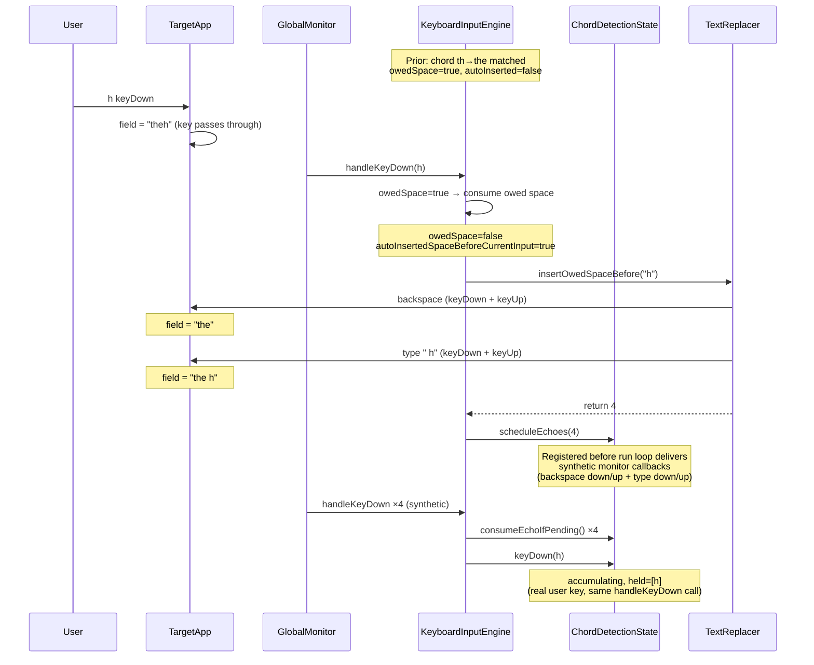
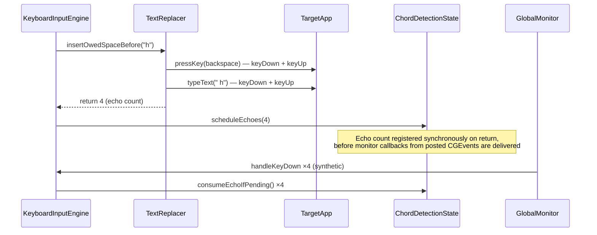
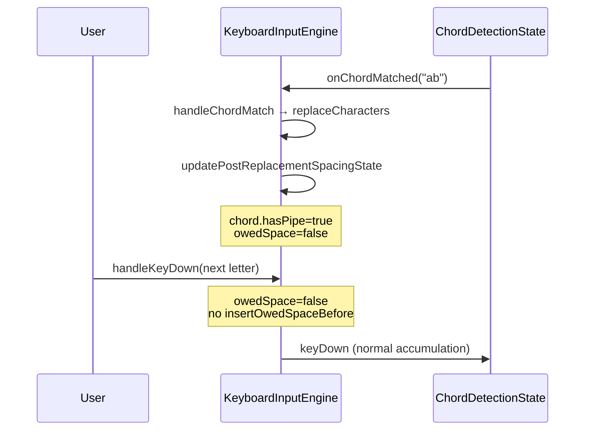
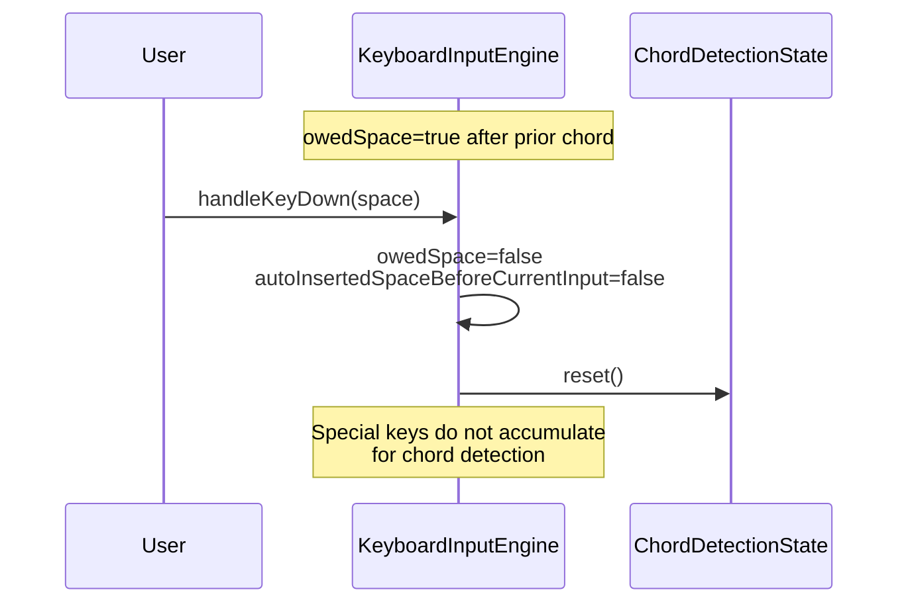
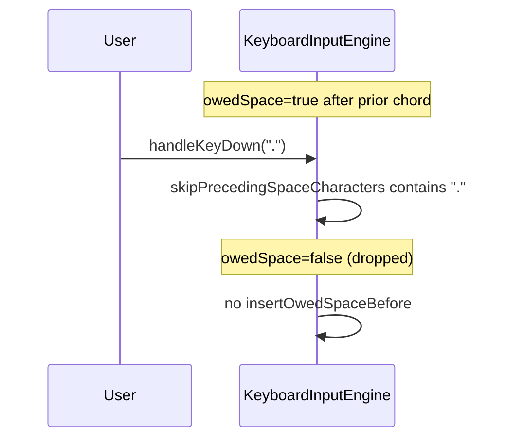
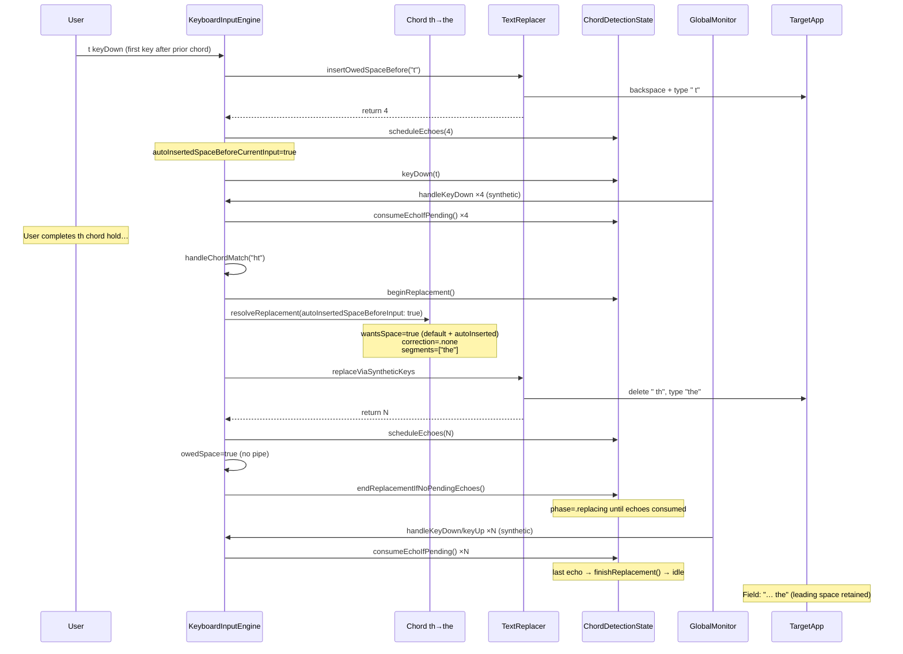
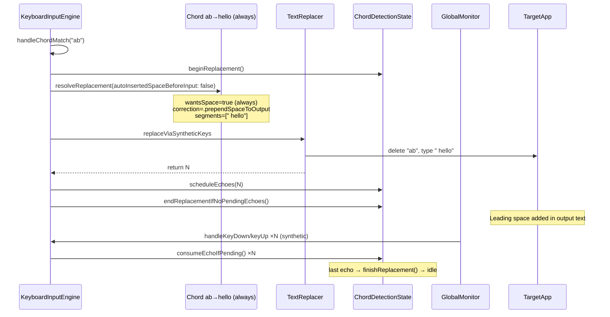
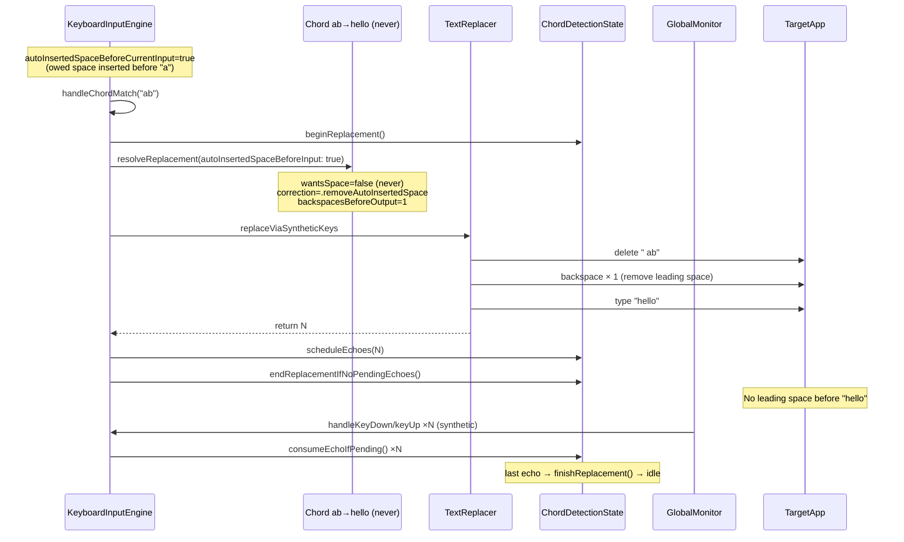
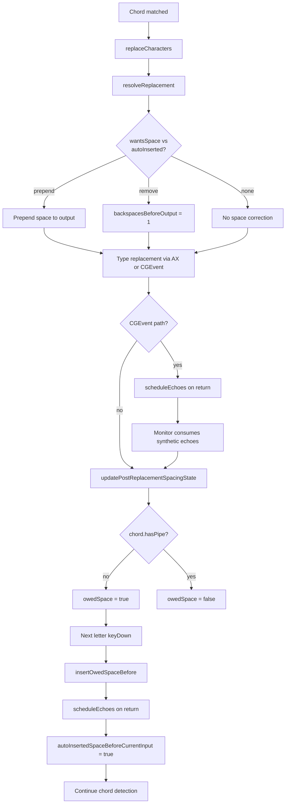

# Space handling sequence diagrams

Sequence diagrams for how spaces are added (and removed) when using the chording keyboard. Logic lives in `KeyboardInputEngine`, `Chord.resolveReplacement`, and `TextReplacer`.

There are two related mechanisms:

1. **Trailing owed space** — after a chord without a pipe (`|`), the engine remembers that the _next_ letter should be preceded by a space.
2. **Space before output** — per-chord setting (`default` / `always` / `never`) that adjusts replacement output when a chord fires, based on whether an owed space was actually inserted before the chord input.

---

## State variables

| Variable                              | Where                      | Meaning                                                                                                                                                       |
| ------------------------------------- | -------------------------- | ------------------------------------------------------------------------------------------------------------------------------------------------------------- |
| `owedSpace`                           | `KeyboardInputEngine`      | After a non-piped chord, the next letter key should trigger auto-space insertion. Exposed as `owesTrailingSpace`.                                             |
| `autoInsertedSpaceBeforeCurrentInput` | `KeyboardInputEngine`      | Set when owed-space insertion runs; passed into `resolveReplacement` so the matched chord knows a leading space was auto-inserted. Cleared after replacement. |
| `spaceBeforeOutputMode`               | `Chord`                    | Per-chord: `default`, `always`, or `never`. Controls whether replacement output should include a leading space.                                               |
| `backspacesBeforeOutput`              | `ResolvedChordReplacement` | Extra backspaces before typing output, to remove an auto-inserted space the chord does not want.                                                              |

---

## Synthetic keys and echo counting

When the engine posts CGEvent synthetic keys (`insertOwedSpaceBefore`, `replaceViaSyntheticKeys`), those events pass through the same global monitor as real user input. To avoid re-processing them:

1. The replacer posts all CGEvents synchronously and returns an echo count.
2. `scheduleEchoes(count)` runs immediately on return (before the run loop delivers synthetic monitor callbacks).
3. Each synthetic `keyDown`/`keyUp` that arrives later hits `consumeEchoIfPending()` in `handleKeyDown`/`handleKeyUp` and is dropped.
4. For chord replacement, `finishReplacement()` runs when the last echo is consumed (or immediately via `endReplacementIfNoPendingEchoes()` on the AX path, which posts no echoes).

In code, both call sites nest the replacer inside `scheduleEchoes`:

```swift
chordDetection.scheduleEchoes(textReplacer.insertOwedSpaceBefore(character: character ?? ""))
chordDetection.scheduleEchoes(textReplacer.replaceViaSyntheticKeys(chord: chord, resolved: resolved))
```

Swift evaluates the argument first, so CGEvent posts always complete before the echo count is registered — but still before monitor delivery.

---

## Trailing owed space

### When owed space is set

After a successful chord replacement, `updatePostReplacementSpacingState` runs:

```swift
owedSpace = !chord.hasPipe
```

Chords whose output contains a pipe (e.g. `hel|lo`) place the cursor mid-output and do **not** enter owed-space mode.

### When owed space is cleared

| Trigger             | Examples                                                                            |
| ------------------- | ----------------------------------------------------------------------------------- |
| Owed space consumed | Next letter keyDown runs insertion                                                  |
| Special keys        | space, tab, backspace, return, escape                                               |
| Navigation          | left/right arrow                                                                    |
| Modifiers           | cmd, option, control, fn                                                            |
| Punctuation         | Characters in `KeyboardConstants.skipPrecedingSpaceCharacters` (e.g. `.`, `,`, `!`) |

---

## Case 1: Chord without pipe → owed space on next letter

**Setup:** Chord `th→the` (no pipe). User has typed `the` via chord; field shows `the`.

**Result:** User presses `h`. Field becomes `the h` (space inserted before `h`).



The user's `h` keyDown reaches the target app first (observe-only monitors). The engine then synthetically backspaces and re-types ` h`, which is why insertion uses `insertOwedSpaceBefore` rather than typing a standalone space.

---

## Case 2: Owed-space insertion — synthetic key sequence

Detail of `TextReplacer.insertOwedSpaceBefore(character:)`:



Echo counting prevents the engine from treating its own synthetic events as new user input. In code, `scheduleEchoes` is the outer call and `insertOwedSpaceBefore` is its argument, so CGEvent posts finish first; echoes are registered on return, still before the run loop delivers those synthetic events to the monitor.

---

## Case 3: Chord with pipe → no trailing owed space

**Setup:** Chord `ab→a|b`. Output places the cursor between `a` and `b`.

**Result:** After replacement, `owedSpace` stays false; the next letter is typed immediately with no auto-space.



---

## Case 4: User cancels owed space before typing

### 4a — User presses space (or backspace, tab, etc.)



### 4b — User presses punctuation (skip list)

Characters like `.`, `,`, `!`, `@` clear owed space without inserting one:



---

## Space before output (per-chord setting)

When a chord matches, `resolveReplacement` decides whether the replacement text needs a leading space or an extra backspace.

### `wantsSpaceBeforeInputWhenTyped`

| Mode      | Wants leading space when…                                                                        |
| --------- | ------------------------------------------------------------------------------------------------ |
| `default` | Global owed-space insertion ran before this chord input (`autoInsertedSpaceBeforeInput == true`) |
| `always`  | Always                                                                                           |
| `never`   | Never                                                                                            |

### Correction matrix

Because owedSpace insertion happens on keyDown, before we know what chord (if any) is being typed, we need to "correct" the space (or lack thereof) once we find out what chord we're typing.

`spaceBeforeOutputCorrection(autoInserted:wantsSpace:)`:

| Auto-inserted before input? | Chord wants space? | Correction                                                      |
| --------------------------- | ------------------ | --------------------------------------------------------------- |
| yes                         | no                 | `.removeAutoInsertedSpace` → `backspacesBeforeOutput = 1`       |
| no                          | yes                | `.prependSpaceToOutput` → prepend `" "` to first output segment |
| yes                         | yes                | `.none`                                                         |
| no                          | no                 | `.none`                                                         |

---

## Case 5: Default mode — owed space before chord input

**Setup:** Chord `th→the`, mode `default`. Prior chord left `owedSpace=true`. User types `th` (owed space inserts before `t`).

**Result:** Replacement types `the` with no extra correction; auto-inserted space is kept because default mode wants space when auto-inserted.



---

## Case 6: Always mode — prepend space at replacement time

**Setup:** Chord `ab→hello`, mode `always`. No owed-space insertion ran (`autoInsertedSpaceBeforeInput=false`).

**Result:** Output is typed as ` hello` (space prepended to first segment).



---

## Case 7: Never mode — remove auto-inserted space before output

**Setup:** Chord `ab→hello`, mode `never`. Owed-space insertion ran before the user typed `ab`.

**Result:** One extra backspace before typing output removes the unwanted leading space.



The Accessibility path uses the same `backspacesBeforeOutput` value: `AccessibilityReplacementVerification` extends the selection backward by one character when `leadingSpaceDeletionCount == 1`.

---

## End-to-end flow (overview)



---

## Quick reference

| Scenario                                        | owedSpace after chord? | Space added how?                      |
| ----------------------------------------------- | ---------------------- | ------------------------------------- |
| `th→the` (no pipe)                              | yes                    | Next letter: backspace + ` ␣{letter}` |
| `ab→a\|b` (pipe)                                | no                     | —                                     |
| User presses space/backspace before next letter | cleared                | —                                     |
| User presses `.` before next letter             | cleared                | —                                     |
| Chord `always`, no auto-space                   | —                      | Prepended to replacement output       |
| Chord `never`, auto-space ran                   | —                      | Extra backspace before output         |
| Chord `default`, auto-space ran                 | —                      | No correction (space kept)            |
| Chord `default`, no auto-space                  | —                      | No leading space                      |

---

## Files to read alongside these diagrams

- [`KeyboardInputEngine.swift`](../Software%20Chording%20Keyboard/Services/KeyboardInputEngine.swift) — `owedSpace`, `handleKeyDown`, `updatePostReplacementSpacingState`
- [`Chord.swift`](../Software%20Chording%20Keyboard/Models/Chord.swift) — `ChordSpaceBeforeOutputMode`, `resolveReplacement`, `spaceBeforeOutputCorrection`
- [`TextReplacer.swift`](../Software%20Chording%20Keyboard/Services/TextReplacer.swift) — `insertOwedSpaceBefore`, `replaceViaSyntheticKeys`
- [`Constants.swift`](../Software%20Chording%20Keyboard/Constants/Constants.swift) — `skipPrecedingSpaceCharacters`
- [`Software_Chording_KeyboardTests.swift`](../Software%20Chording%20KeyboardTests/Software_Chording_KeyboardTests.swift) — `testKeyboardInputEngineOwedSpaceKeyDownSchedulesEchoesBeforeAccumulatingKeys`, `testSpaceBeforeOutputCorrectionMatrix`, `testResolveReplacementPrependsSpaceWhenNeeded`
